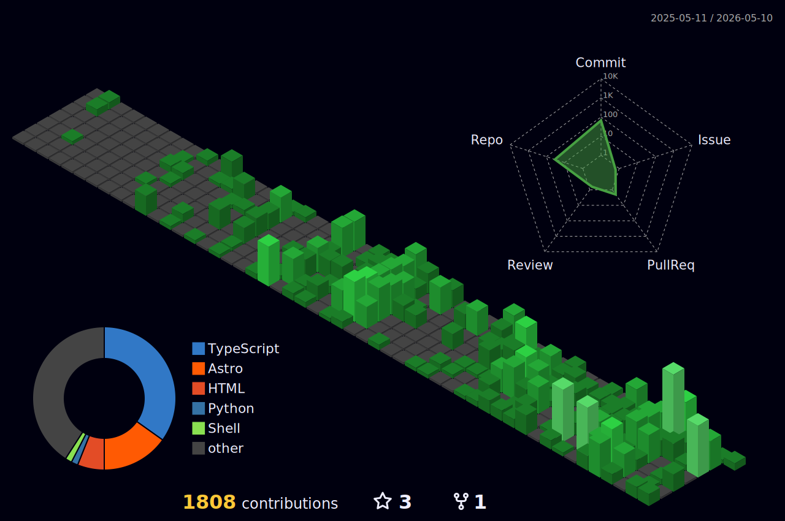

<div align="center">

# Maz Benoscar

**AI systems · workflows · infrastructure**

[](https://git.io/typing-svg)

</div>

---

### `~/whoami`



```text
> Independent Full-Stack AI Systems Builder based in Ontario, Canada.
> 15+ years across finance, investment analysis, and operations before moving fully into AI systems development.
> I build commercially useful AI systems across automation, analytics, and workflow infrastructure.
>
> Things I trust:
>   • boring infrastructure under the demo
>   • craft that compounds quietly
>   • benchmarks that include the boring case
```

---

### Currently shipping

```text
─────────────────────────────────────────────────────────────────────────
PROD     Prompt Alchemy          Curated AI prompt + asset library SaaS · vault + CMS
SHIP     HearIQ (SayItStream)    Chrome TTS extension · Web Store launch
BUILD    Plant Triage            RN app · Gemini + Qwen-VL ensemble vision
BUILD    Space Peace             50k+ LOC RN device cleanup app
BUILD    Lastmile                Polymarket arb engine · pluggable strategies + MCP
BUILD    Lastmile Analytics      Polymarket trader scoring · discovery pipeline + UI
OSS      Google Ads MCP          Ads + GTM + GA4 unified · agency-grade workflows
OSS      WaveSpeed AI            Skill · 700+ image/video models · agent-agnostic
OSS      Perplexity MCP Server   Web search MCP for Claude
OSS      Claude-Skills           Custom skill/workflow system for Claude
─────────────────────────────────────────────────────────────────────────
```

---

### Featured

#### Google Ads MCP
Agency-grade Google Ads + GTM + GA4 orchestration via MCP.

```text
google-ads-mcp
│
├─ 101 MCP servers ────► tools surfaced to any MCP-capable agent
├─ 110 services    ────► campaigns · audits · planning · bids · GTM · GA4
├─ 4 API clients   ────► Google Ads v23 · GTM · GA4 · PageSpeed
└─ safety layer    ────► validate_only · approval gates · mutation journal

1,531 tests · pyright strict · MCC-grade
```

#### Prompt Alchemy &nbsp;·&nbsp; [promptalchemy.pro](https://promptalchemy.pro)
Curated AI prompt + asset library SaaS for non-technical professionals.

```text
prompt-alchemy
│
├─ curated library ────► expert prompts · image prompts · automations · tutorials
├─ prompt workbench────► variable-fill · live preview · copy / open to GPT·Claude·Gemini
├─ hybrid search   ────► pgvector semantic + faceted · OpenAI text-embedding-3-small
├─ private vault   ────► favorites · collections · private prompts · tier-gated access
├─ super-admin CMS ────► authoring · content packs · LiteLLM gateway · audit log
└─ billing         ────► Free / Plus / Pro · Stripe · Paddle · Polar · Dodo

Next.js 16 · React 19 · Drizzle + Neon Postgres · Inngest · NextAuth
```

#### Lastmile
Polymarket arbitrage engine with pluggable strategies and analytics.

```text
lastmile
│
├─ 3 strategies    ────► UMA resolution-lag · heavyfav · event_voting
├─ execution core  ────► brain · executor · breaker · killswitch
├─ MCP control     ────► any MCP-capable agent can introspect or trade
├─ ops dashboard   ────► positions · trades · candidates · paper-mode soak
└─ analytics       ────► trader discovery · whale scoring · CLOB pipeline

Anthropic + Perplexity reasoning · Polymarket Data/CLOB/Subgraph APIs
```

#### Space Peace
iOS + Android device hygiene app with editorial-grade native UI.

```text
space-peace
│
├─ Expo + RN       ────► native iOS/Android · 50k+ LOC · expo-router
├─ Convex backend  ────► realtime sync · Better Auth · Apple sign-in
├─ device APIs     ────► battery · contacts · media · haptics · biometrics
├─ NativeWind UI   ────► Tailwind-styled · Orbitron display + Plus Jakarta
└─ FlashList       ────► 60fps scroll across 10k+ media items

Editorial-grade typography · biometric-secured · native haptics throughout
```

#### Plant Triage
Camera-first plant diagnostics powered by ensemble AI vision.

```text
plant-triage
│
├─ Expo + RN       ────► native iOS/Android · expo-router file-based nav
├─ Convex + R2     ────► realtime backend · Cloudflare R2 image storage
├─ camera-first    ────► expo-camera · image-picker · image-manipulator
├─ AI ensemble     ────► Gemini + Qwen-VL · per-leaf diagnostic confidence
└─ Merriweather UI ────► serif-led editorial · expo-blur · location-aware

10,000+ species · 4-step swipe onboarding · diagnose → treat in one tap
```

---

### Stack


---

### `cat ./focus.txt`

```text
💼 Day job        AI Solutions Architect (independent)
🔭 Building       Google Ads MCP · WaveSpeed AI · Skill for Claude Code, Codex, OpenCode
🌱 Learning       Agentic workflows · MCP at scale · video-gen pipelines
💬 Ask me about   AI × finance × blockchain · MCP · RAG · TS/Python
🎯 Looking for    Product collaborations · AI systems + workflow projects
⚡ Fun fact       8+ AI systems running in parallel · solo operator
```

---

<div align="center">

### Activity

[](https://github.com/MazBenOscar)

</div>

---

<div align="center">

### Contributions



</div>

---

<div align="center">

[](https://github.com/piyushsuthar/github-readme-quotes)

</div>

---

<div align="center">

### Reach me

[](mailto:maz@benoscar.co)
[](https://x.com/bennyoscar)
[](https://github.com/MazBenOscar)

</div>


